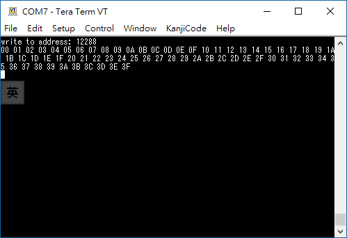

# lpc1114_duignan_i2c_eeprom
a simple kit for develop NXP LPC111x MCU, base on duignan's code and then add i2c eeprom access function

base on a project form https://batchloaf.wordpress.com/2013/11/29/simple-arm-example-for-lpc1114/

and then to add uart feature
and then to add i2c eeprom access feature
( we also add Systick timer based delay_ms() function,
  and irq.h to implement NVIC IRQ relative function for support i2c,
  and init.c line 11 & line 55 was modified to make i2c interrupt work properly.
)

Usage:
  1. using build.bat to build the project,
   will output main.hex in the out folder.

  2. using flash magic utility to burn main.hex into lpc111x mcu's flash
  3. open Terminal (for example, Tera Term or Putty) and set baut rate to 38400
  4. reset lpc111x mcu,
  5. the Terminal should display 'led on, led off, ...'

Notes:
  For detail operation, please reference the link above.

Screenshot

  
  
